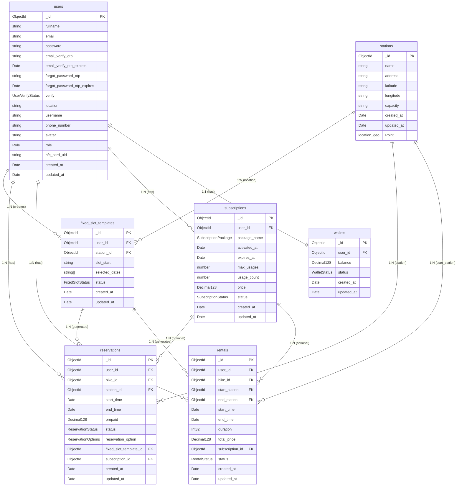
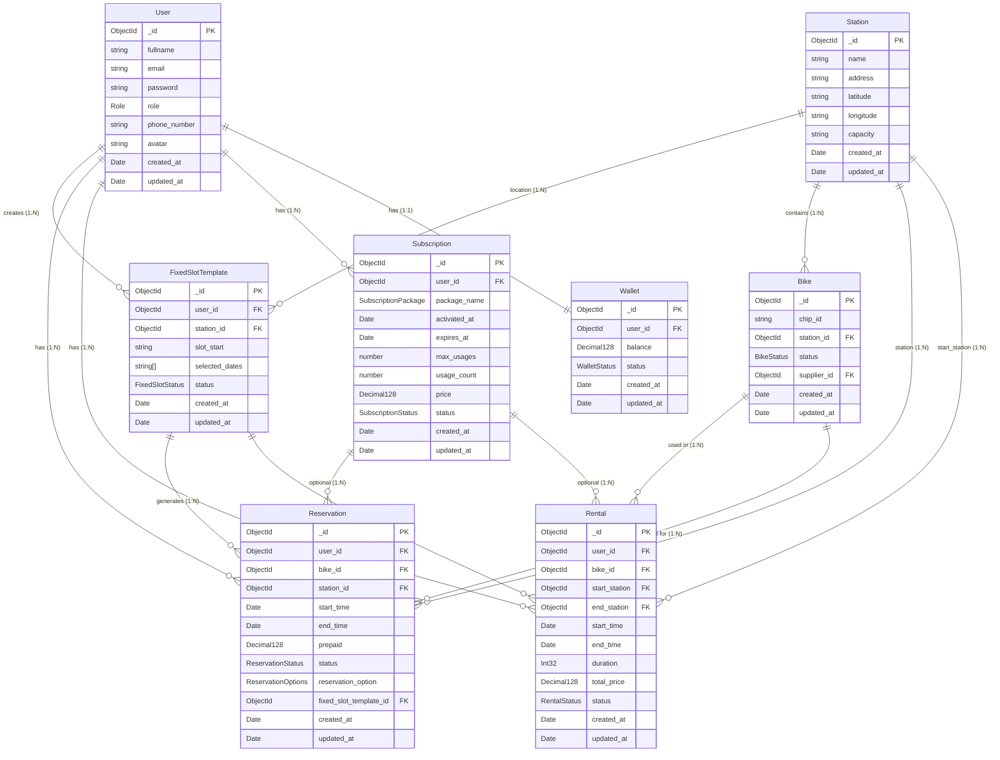
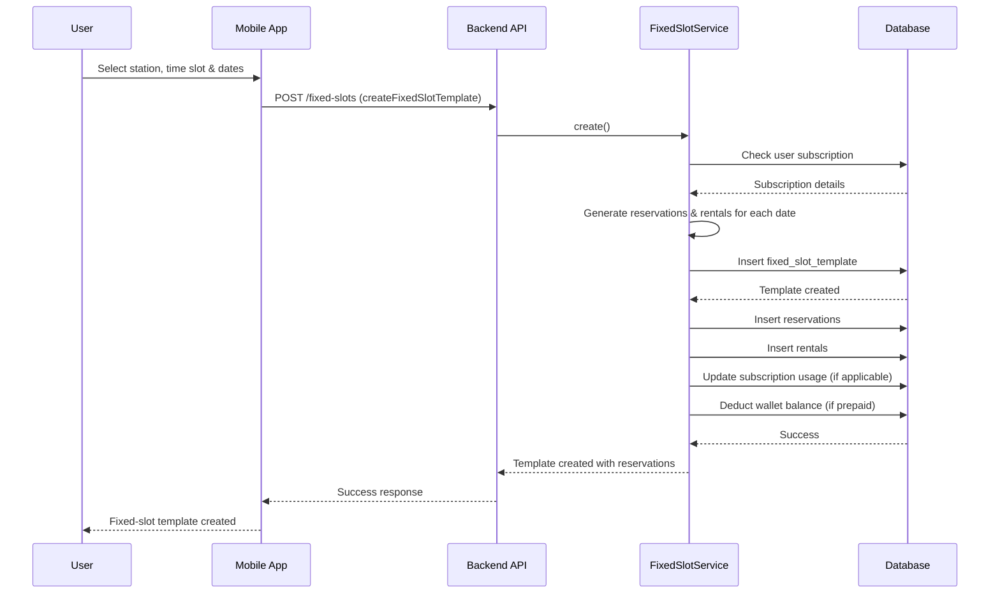
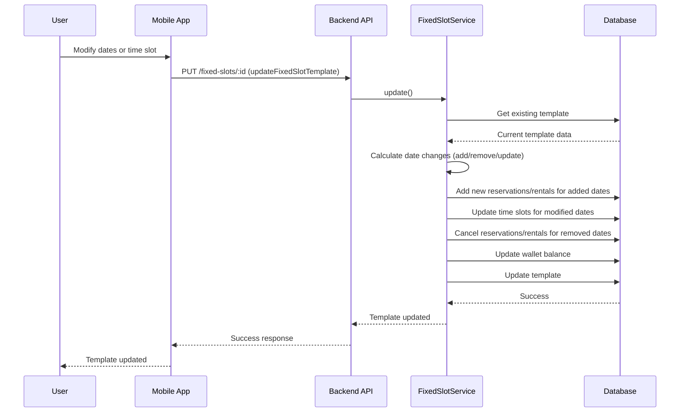
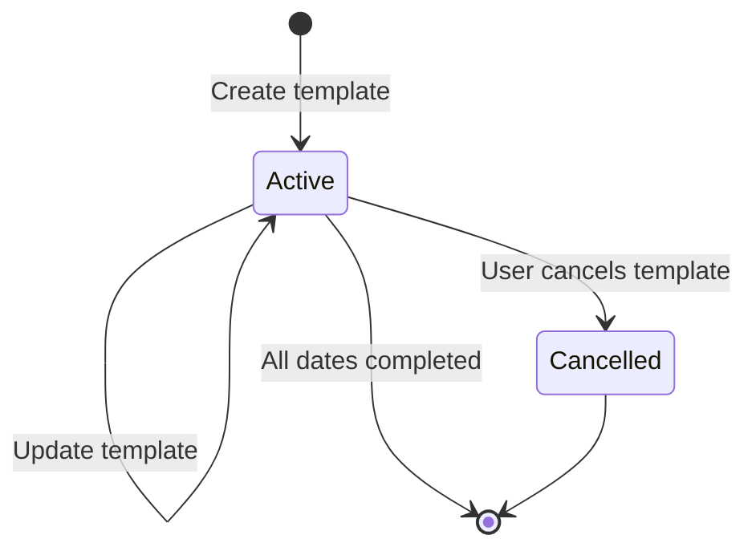
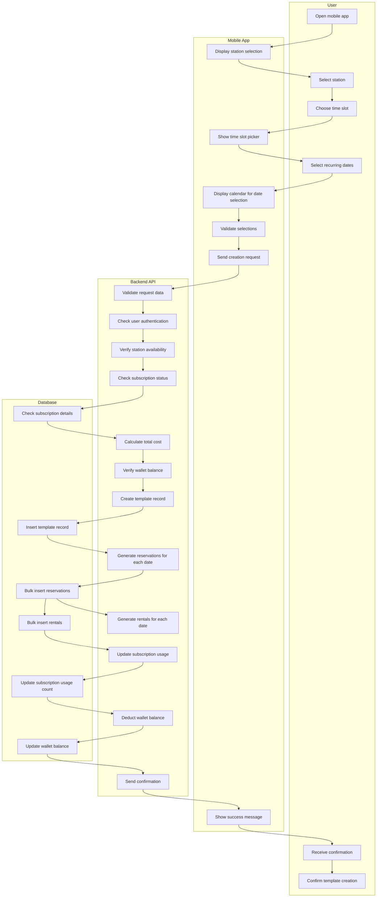

# MeBike Fixed-Slot System Diagrams

## Physical Database Diagram (ER Diagram)



## Class Diagram (Crow's Foot Notation)



## Class Operations

**User Operations:**
- login(), register(), updateProfile(), changePassword()
- getMyFixedSlotTemplates(), getMyReservations(), getMyRentals()

**FixedSlotTemplate Operations:**
- createTemplate(), updateTemplate(), cancelTemplate()
- generateReservations(), generateRentals(), getDetail()

**Station Operations:**
- addBike(), removeBike(), getAvailableBikes()
- getNearbyStations(), updateCapacity()

**Reservation Operations:**
- createReservation(), confirmReservation(), cancelReservation()
- expireReservation(), getReservationHistory(), notifyExpiring()

**Rental Operations:**
- createRental(), endRental(), calculatePrice()
- updateStatus(), cancelRental(), getDetail()

**Subscription Operations:**
- activate(), renew(), cancel()
- checkUsageLimit(), getRemainingUsage()

**Wallet Operations:**
- addBalance(), deductBalance(), checkBalance()
- getTransactionHistory(), freezeWallet(), unfreezeWallet()

## Sequence Diagram - Fixed-Slot Template Creation



## Sequence Diagram - Fixed-Slot Template Update



## State Diagram - Fixed-Slot Template Lifecycle



## Activity Diagram - Fixed-Slot Creation Process (Swimlane)



## Activity Diagram - Fixed-Slot Update Process (Swimlane)

```mermaid
flowchart TD
    subgraph "User"
        A1[View existing template]
        A2[Modify dates or time]
        A3[Confirm changes]
        A4[Receive update confirmation]
    end

    subgraph "Mobile App"
        B1[Display template details]
        B2[Show edit interface]
        B3[Validate changes]
        B4[Send update request]
        B5[Show update result]
    end

    subgraph "Backend API"
        C1[Validate update request]
        C2[Get current template]
        C3[Analyze date changes]
        C4[Process added dates]
        C5[Process removed dates]
        C6[Process time changes]
        C7[Update wallet balance]
        C8[Update template record]
        C9[Send update confirmation]
    end

    subgraph "Database"
        D1[Retrieve template data]
        D2[Insert new reservations/rentals]
        D3[Cancel old reservations/rentals]
        D4[Update existing records]
        D5[Update wallet transactions]
        D6[Update template]
    end

    A1 --> B1
    B1 --> A2
    A2 --> B2
    B2 --> B3
    B3 --> B4
    B4 --> C1
    C1 --> C2
    C2 --> D1
    D1 --> C3
    C3 --> C4
    C4 --> D2
    D2 --> C5
    C5 --> D3
    D3 --> C6
    C6 --> D4
    D4 --> C7
    C7 --> D5
    D5 --> C8
    C8 --> D6
    D6 --> C9
    C9 --> B5
    B5 --> A4
    A4 --> A3