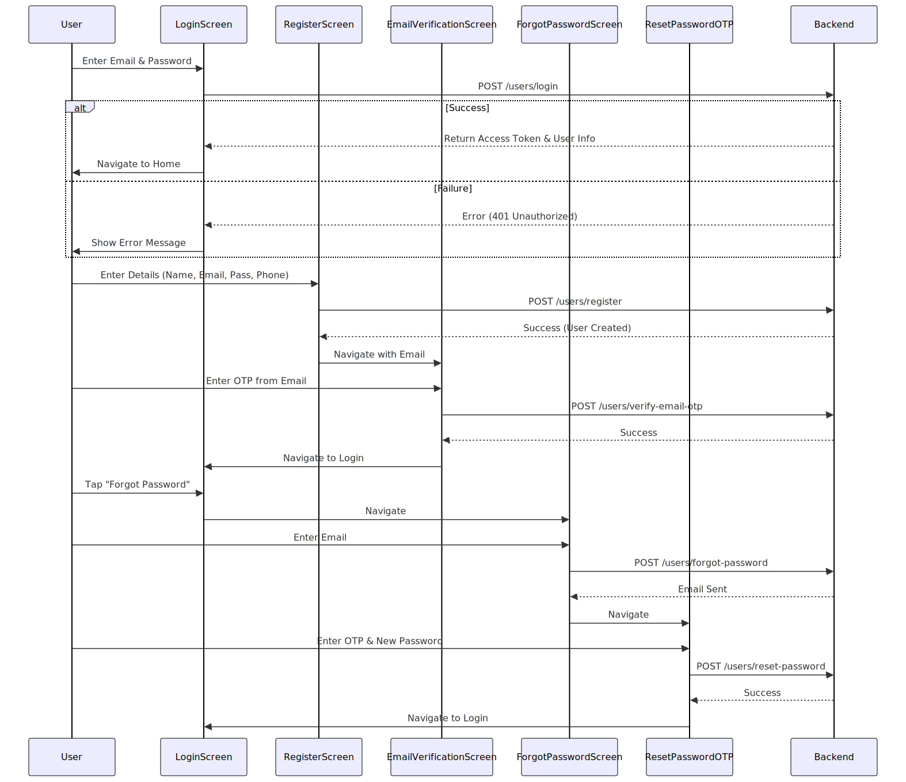
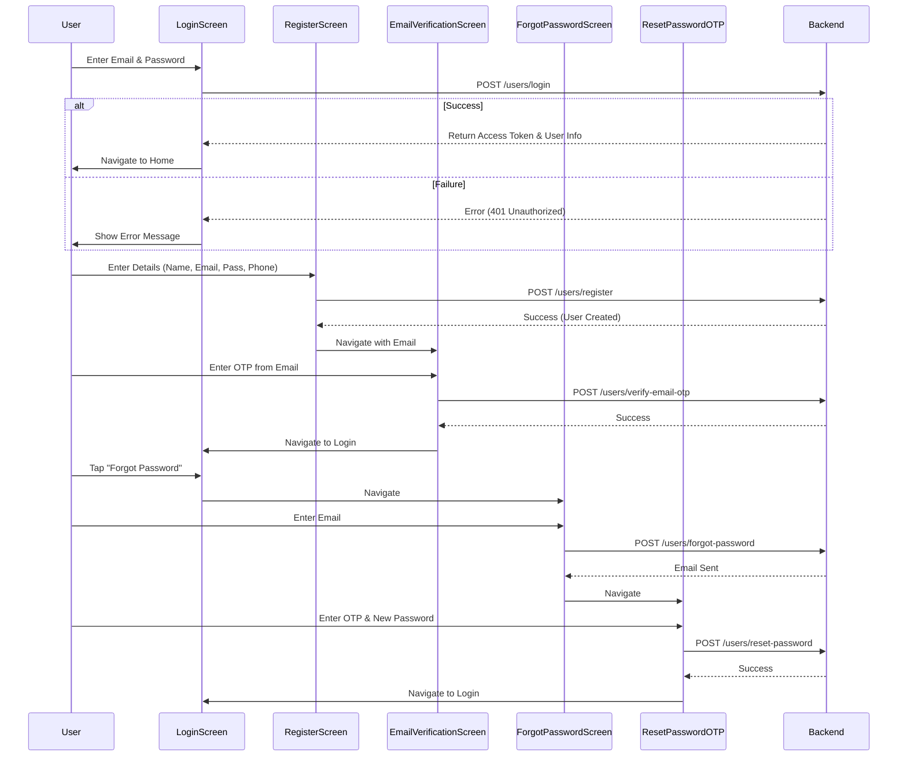

# Authentication Flow

**Participants:**
- **User**: The end user.
- **Screens**: `LoginScreen`, `RegisterScreen`, `EmailVerificationScreen`, `ForgotPasswordScreen`, `ResetPasswordOTP`.
- **Backend**: The API server.

