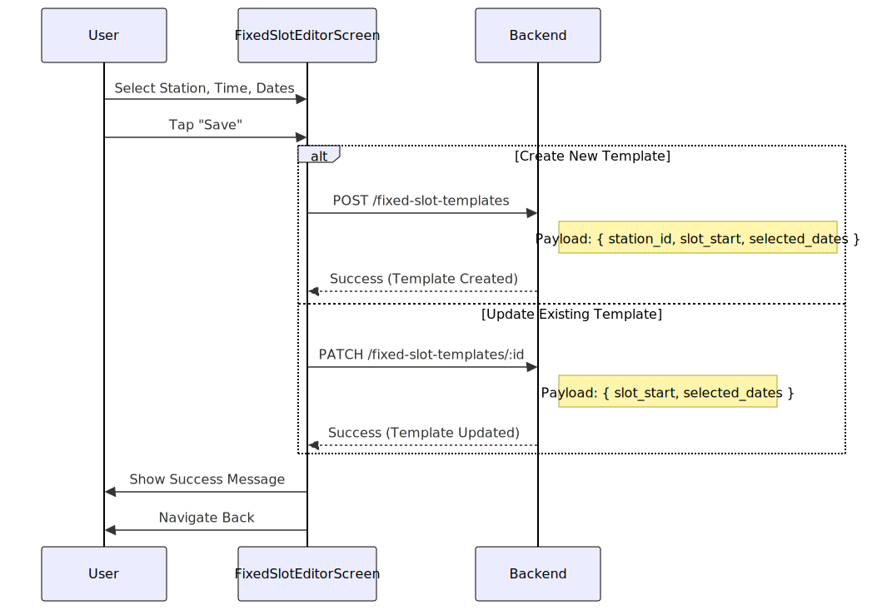
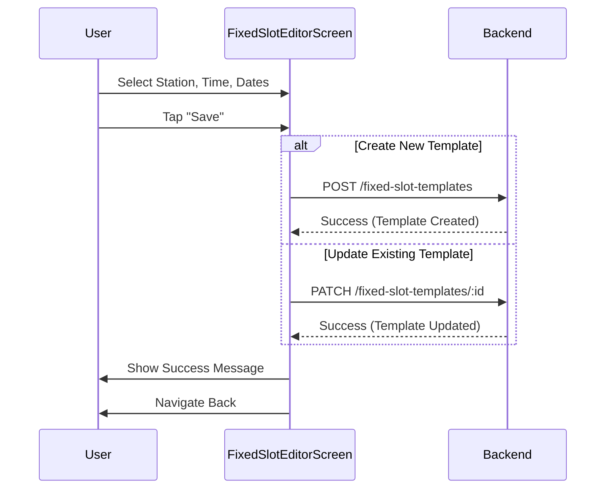

# Fixed Slot Reservation Flow

**Participants:**
- **User**: The end user.
- **Screens**: `FixedSlotEditorScreen`.
- **Backend**: The API server.

```mermaid
sequenceDiagram
    participant User
    participant FixedSlotEditorScreen
    participant Backend

    User->>FixedSlotEditorScreen: Select Station, Time, Dates
    User->>FixedSlotEditorScreen: Tap "Save"
    
    alt Create New Template
        FixedSlotEditorScreen->>Backend: POST /fixed-slot-templates
        Backend-->>FixedSlotEditorScreen: Success (Template Created)
    else Update Existing Template
        FixedSlotEditorScreen->>Backend: PATCH /fixed-slot-templates/:id
        Backend-->>FixedSlotEditorScreen: Success (Template Updated)
    end

    FixedSlotEditorScreen->>User: Show Success Message
    FixedSlotEditorScreen->>User: Navigate Back
```
