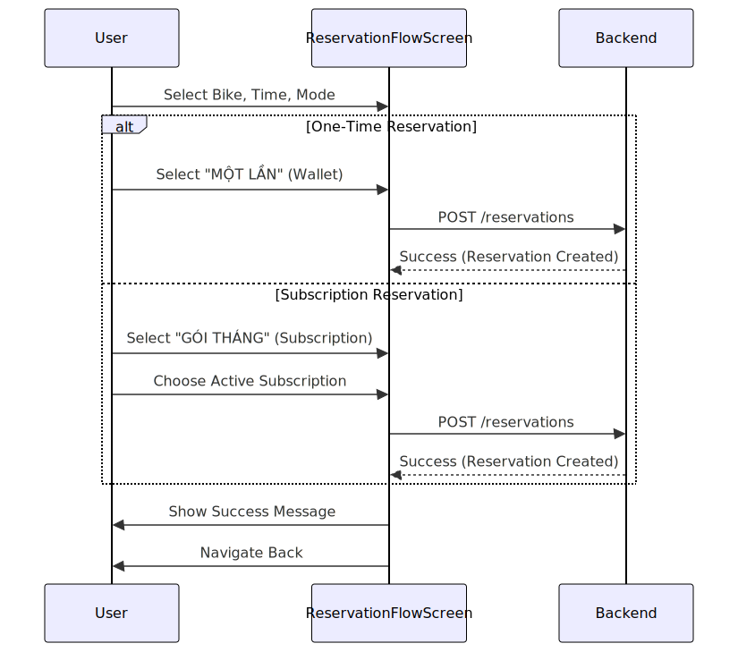
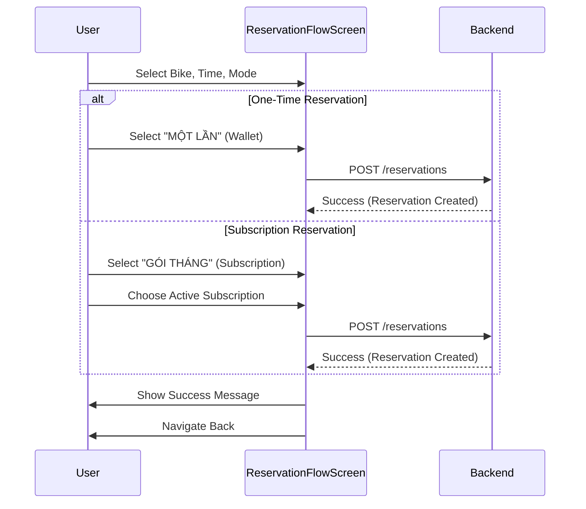

# Rental Reservation Flow

**Participants:**
- **User**: The end user.
- **Screens**: `ReservationFlowScreen`.

```mermaid
sequenceDiagram
    participant User
    participant ReservationFlowScreen
    participant Backend

    User->>ReservationFlowScreen: Select Bike, Time, Mode
    
    alt One-Time Reservation
        User->>ReservationFlowScreen: Select "MỘT LẦN" (Wallet)
        ReservationFlowScreen->>Backend: POST /reservations
        Backend-->>ReservationFlowScreen: Success (Reservation Created)
    else Subscription Reservation
        User->>ReservationFlowScreen: Select "GÓI THÁNG" (Subscription)
        User->>ReservationFlowScreen: Choose Active Subscription
        ReservationFlowScreen->>Backend: POST /reservations
        Backend-->>ReservationFlowScreen: Success (Reservation Created)
    end

    ReservationFlowScreen->>User: Show Success Message
    ReservationFlowScreen->>User: Navigate Back
```
