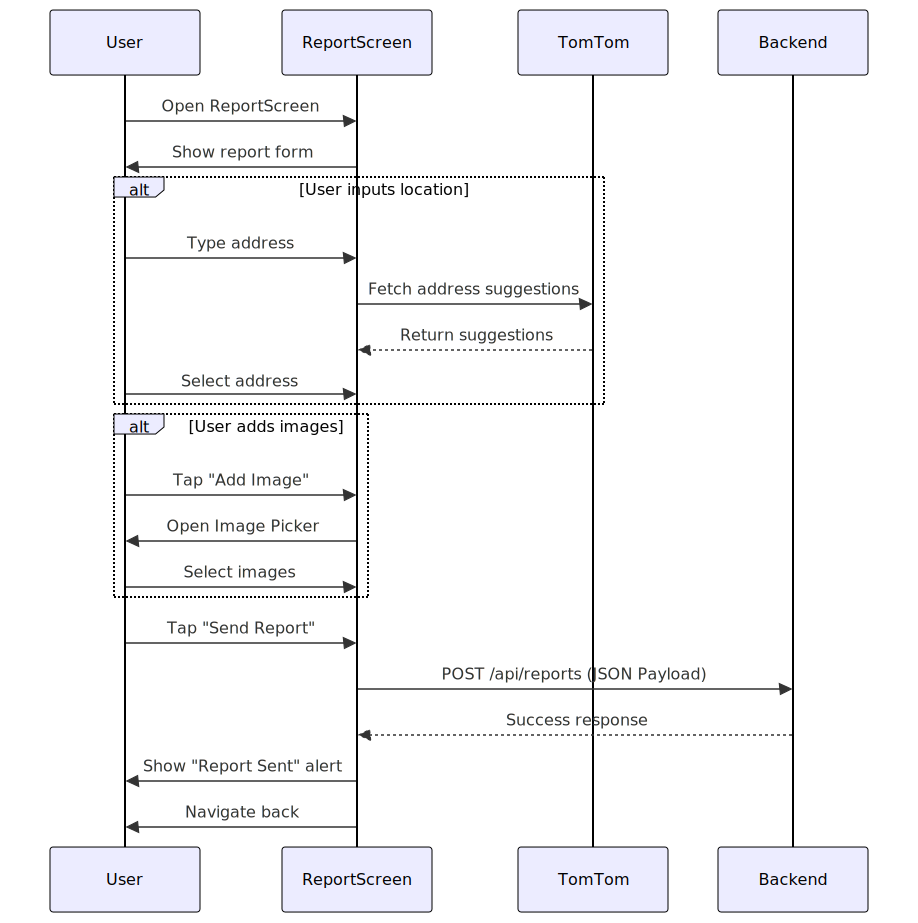
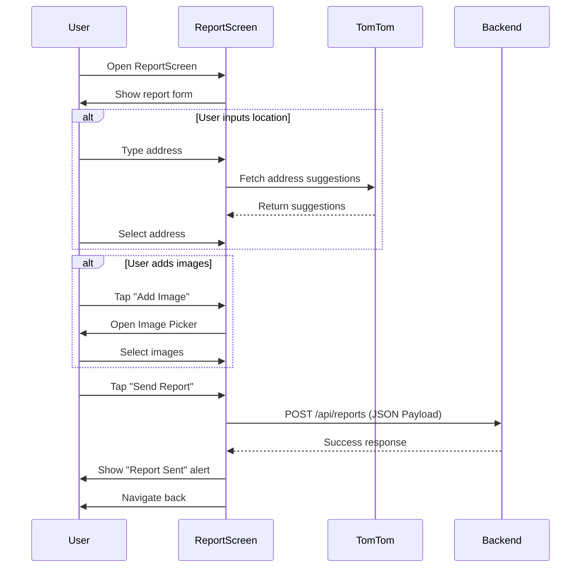

# Report Issue Flow

**Participants:**
- **User**: The end user.
- **ReportScreen**: `ReportScreen` component.
- **Backend**: The API server.
- **TomTom**: External Map API (for address suggestions).

