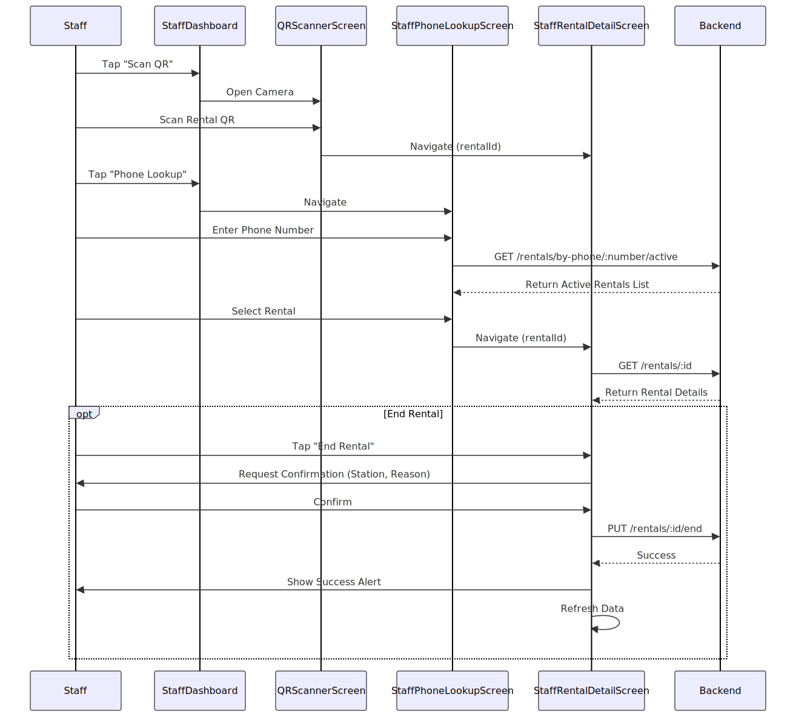
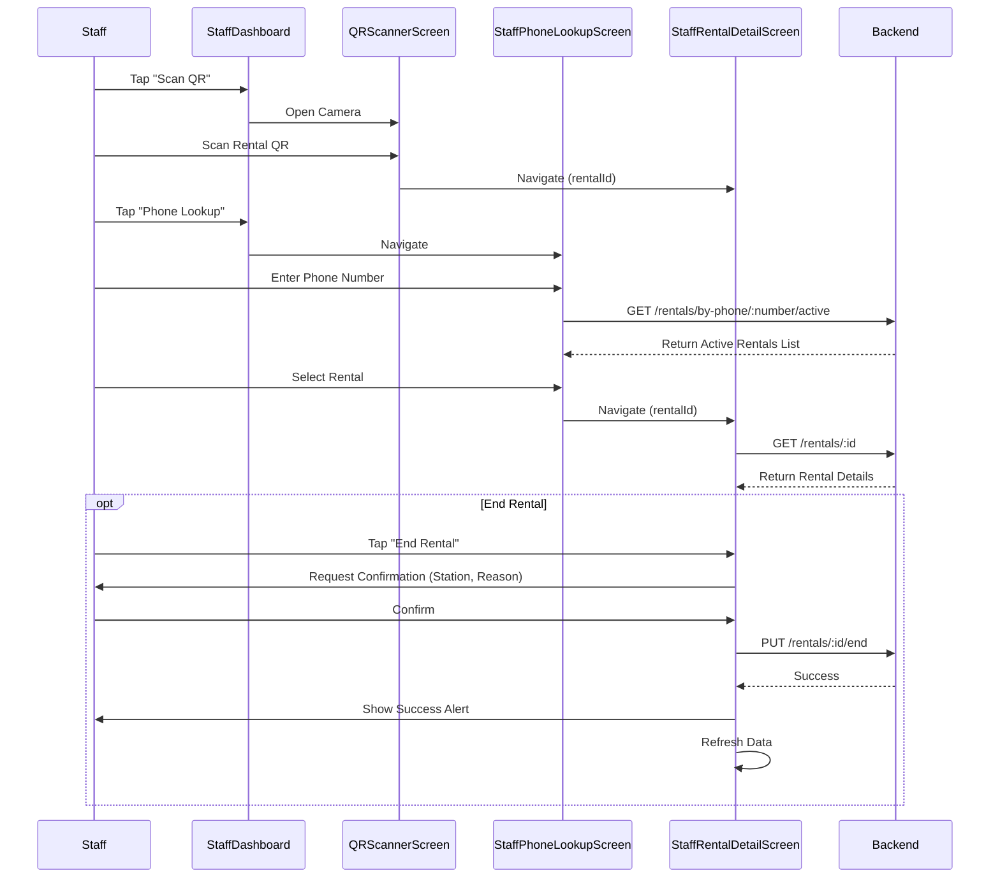

# Staff Operations Flow

**Participants:**
- **Staff**: The staff user.
- **StaffDashboard**: `StaffDashboardScreen` component.
- **Scanner**: `QRScannerScreen` component.
- **Backend**: The API server.

