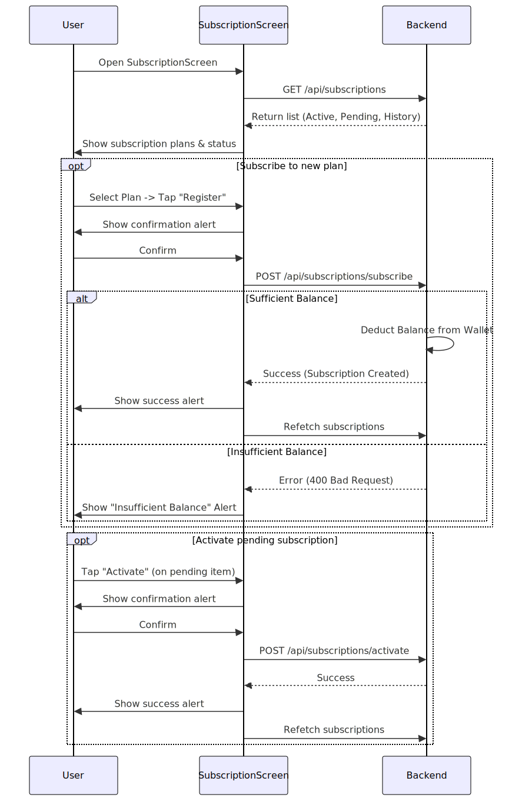
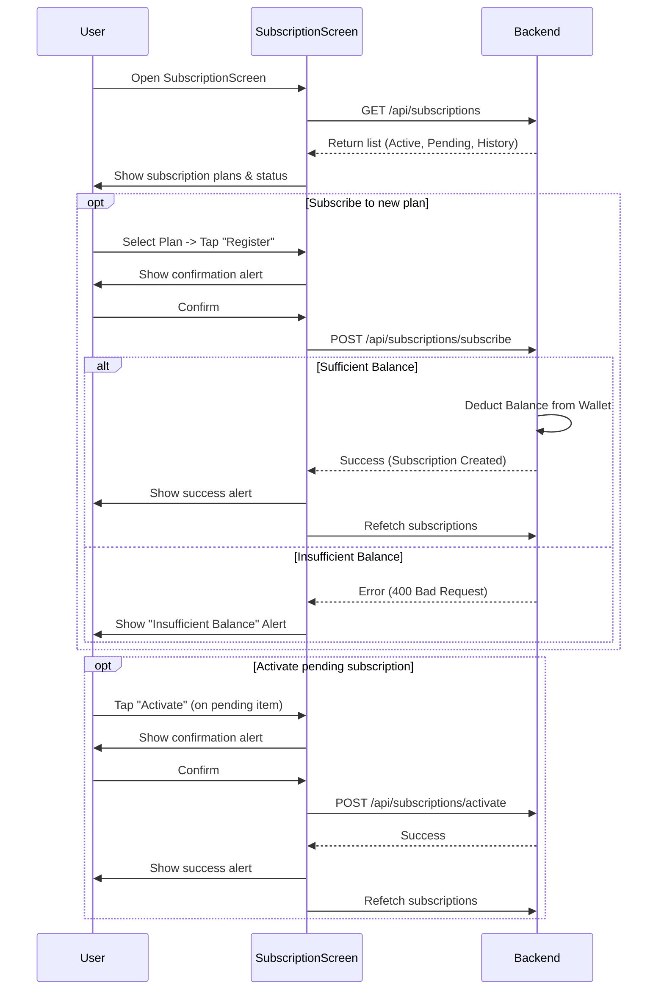

# Subscription Purchase Flow

**Participants:**
- **User**: The end user.
- **SubscriptionScreen**: `SubscriptionScreen` component.
- **Backend**: The API server.

```mermaid
sequenceDiagram
    participant User
    participant SubscriptionScreen
    participant Backend

    User->>SubscriptionScreen: Open SubscriptionScreen
    SubscriptionScreen->>Backend: GET /api/subscriptions
    Backend-->>SubscriptionScreen: Return list (Active, Pending, History)
    SubscriptionScreen->>User: Show subscription plans & status

    opt Subscribe to new plan
        User->>SubscriptionScreen: Select Plan -> Tap "Register"
        SubscriptionScreen->>User: Show confirmation alert
        User->>SubscriptionScreen: Confirm
        SubscriptionScreen->>Backend: POST /api/subscriptions/subscribe
        
        alt Sufficient Balance
            Backend->>Backend: Deduct Balance from Wallet
            Backend-->>SubscriptionScreen: Success (Subscription Created)
            SubscriptionScreen->>User: Show success alert
            SubscriptionScreen->>Backend: Refetch subscriptions
        else Insufficient Balance
            Backend-->>SubscriptionScreen: Error (400 Bad Request)
            SubscriptionScreen->>User: Show "Insufficient Balance" Alert
        end
    end

    opt Activate pending subscription
        User->>SubscriptionScreen: Tap "Activate" (on pending item)
        SubscriptionScreen->>User: Show confirmation alert
        User->>SubscriptionScreen: Confirm
        SubscriptionScreen->>Backend: POST /api/subscriptions/activate
        Backend-->>SubscriptionScreen: Success
        SubscriptionScreen->>User: Show success alert
        SubscriptionScreen->>Backend: Refetch subscriptions
    end
```
