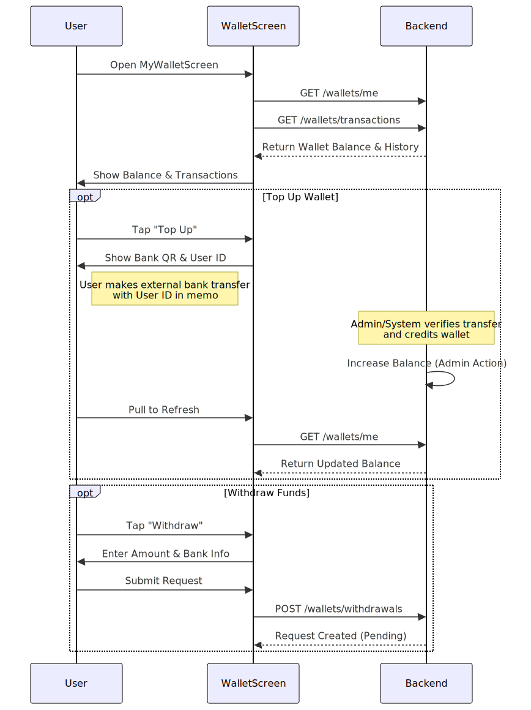
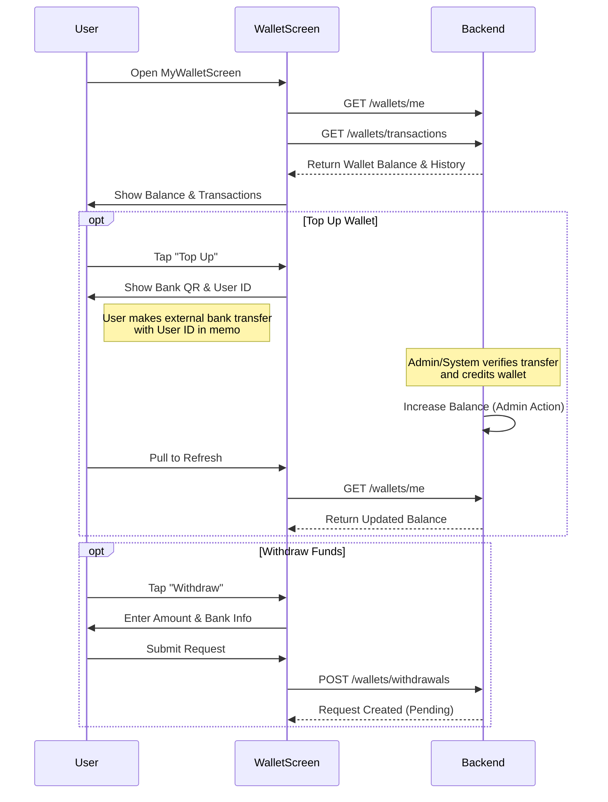

# Wallet & Payment Flow

**Participants:**
- **User**: The end user.
- **WalletScreen**: `MyWalletScreen` component.
- **Backend**: The API server.
- **PaymentGateway**: External Payment Provider (e.g., VNPay/Momo - implied).

