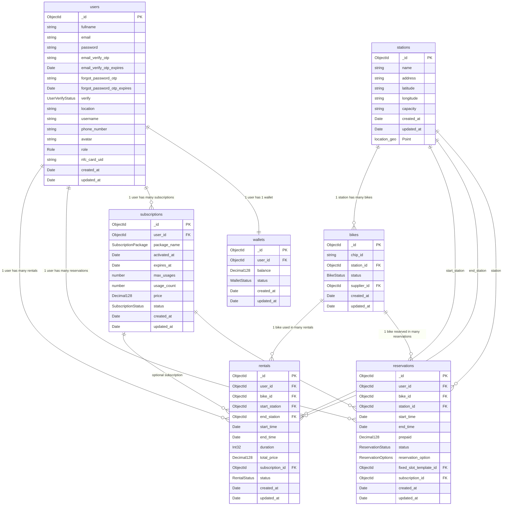
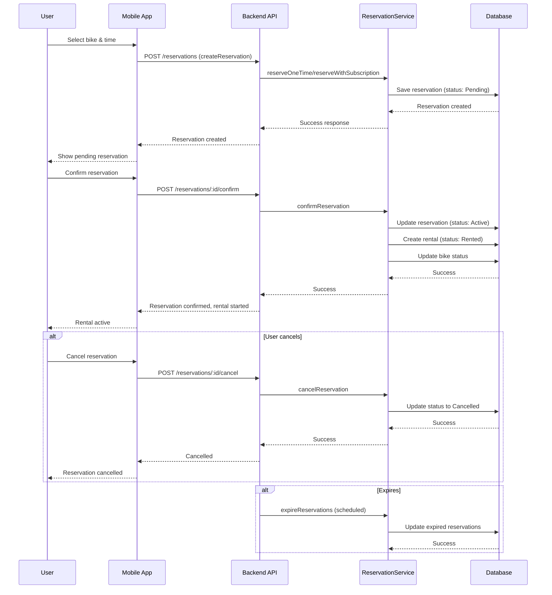
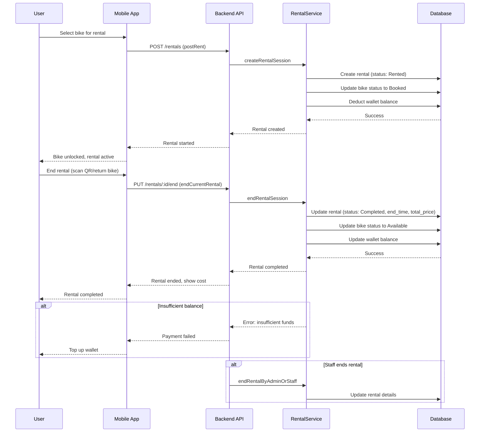
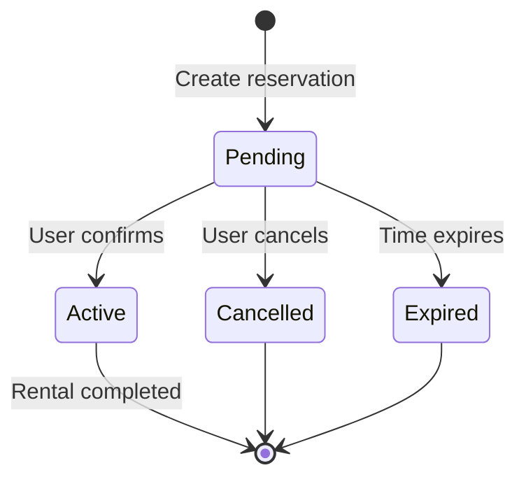
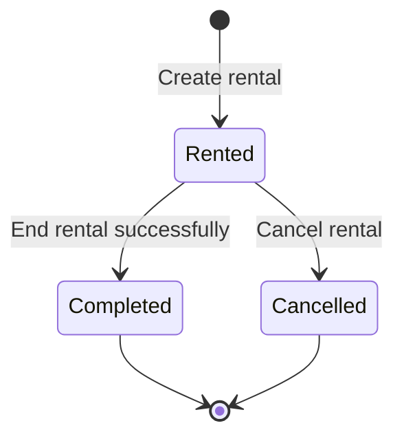

# MeBike Rental/Reservation System Diagrams

## Physical Database Diagram (ER Diagram)



## Sequence Diagram - Reservation Flow



## Sequence Diagram - Rental Flow



## State Diagram - Reservation Lifecycle



## State Diagram - Rental Lifecycle



## Activity Diagram - Overall Rental/Reservation Process

```mermaid
flowchart TD
    A[User wants to use bike] --> B{Choose option}
    B --> C[Reserve bike]
    B --> D[Rent directly]

    C --> C1[Select bike & time]
    C1 --> C2[Create reservation]
    C2 --> C3{Reservation status}
    C3 -->|Pending| C4{User action}
    C4 -->|Confirm| C5[Confirm reservation]
    C5 --> C6[Create rental]
    C6 --> E[Use bike]
    C4 -->|Cancel| C7[Cancel reservation]
    C7 --> F[End]
    C3 -->|Expired| C8[Reservation expired]
    C8 --> F

    D --> D1[Select bike]
    D1 --> D2[Create rental]
    D2 --> E

    E --> G{End rental}
    G -->|Success| H[Rental completed]
    H --> I[Calculate cost]
    I --> J[Update wallet]
    J --> K[Update bike status]
    K --> F

    G -->|Fail| L{Reason}
    L -->|Balance| M[Insufficient funds]
    M --> N[Top up wallet]
    N --> G
    L -->|Other| O[Handle error]
    O --> F