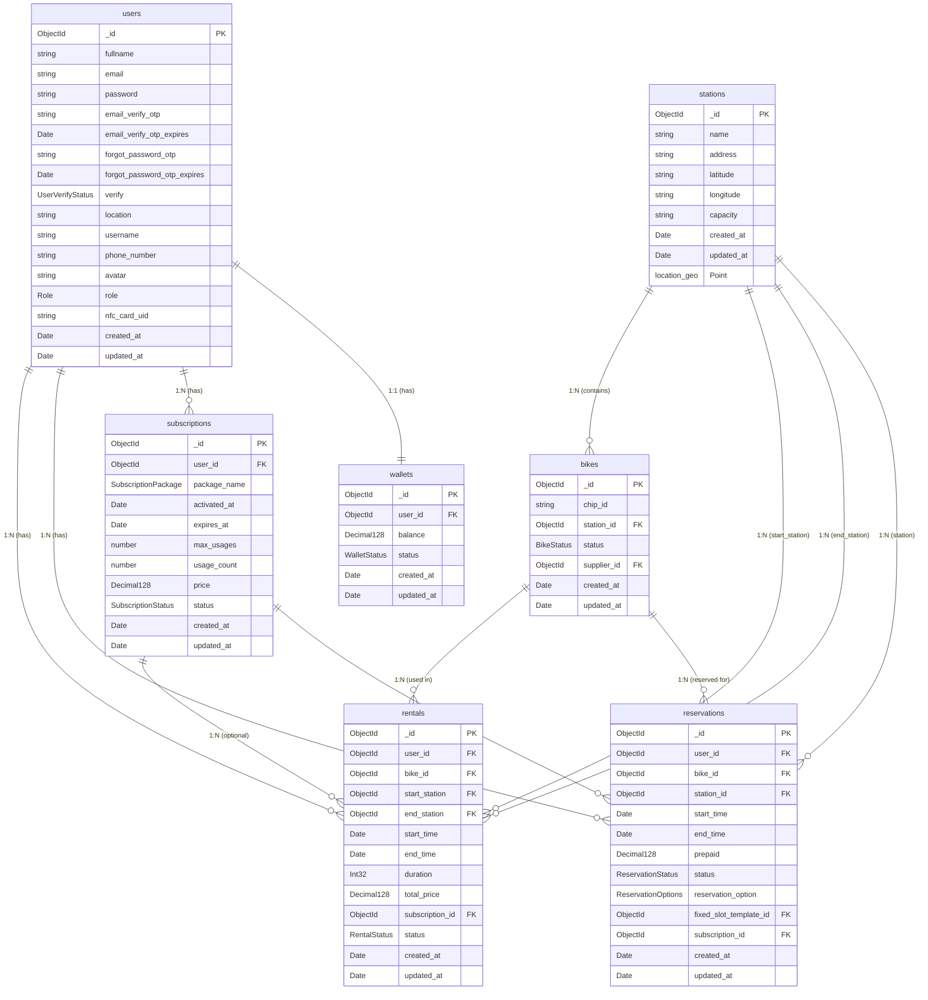
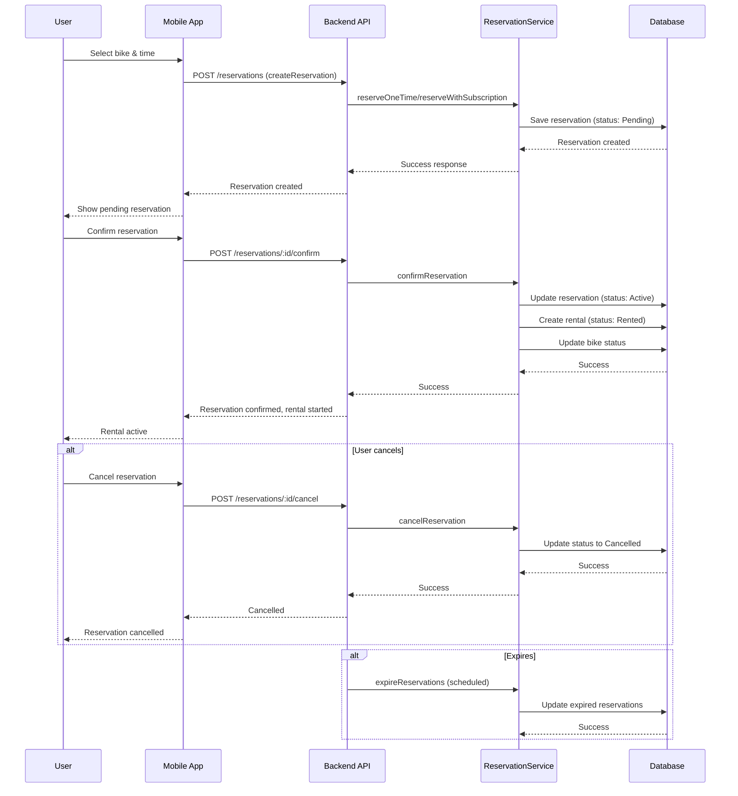
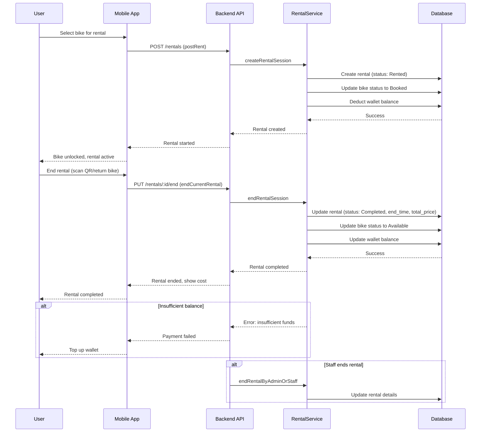
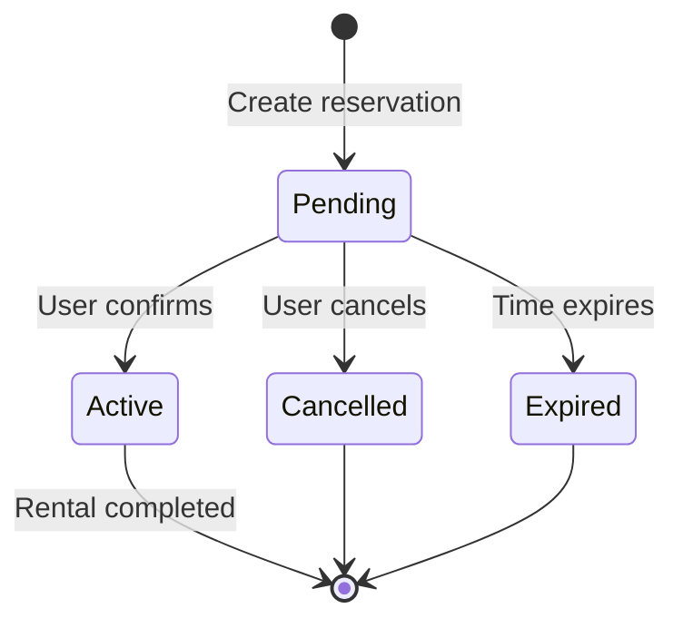
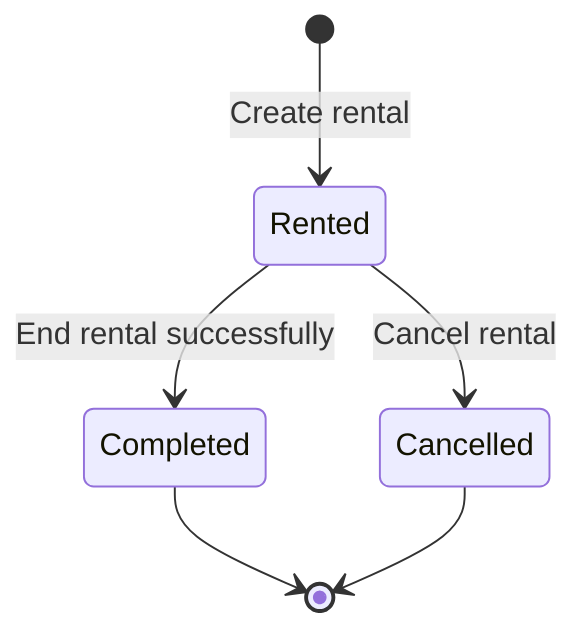
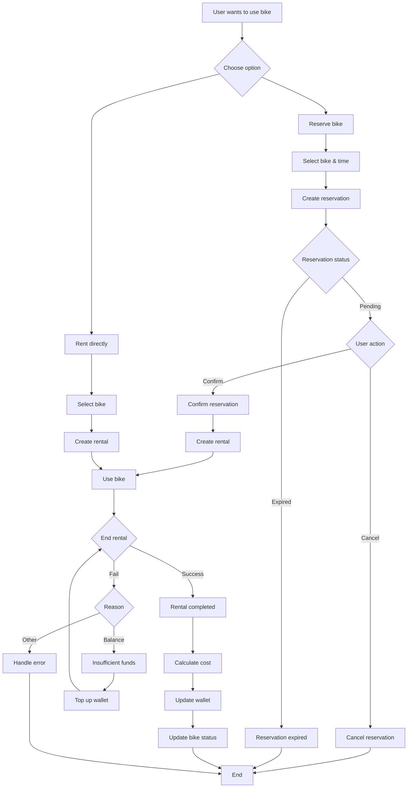
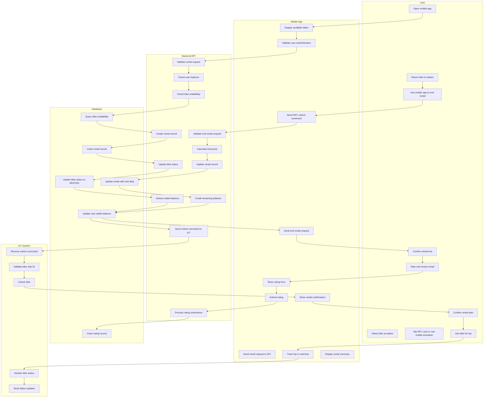

# MeBike Rental/Reservation System Diagrams

## Physical Database Diagram (ER Diagram)



## Class Diagram

```mermaid
classDiagram
    class User {
        +_id
        +fullname
        +email
        +password
        +role
        +phone_number
        +avatar
        +rentals
        +reservations
        +subscriptions
        +wallet
        +login()
        +register()
        +updateProfile()
        +changePassword()
        +getMyRentals()
        +getMyReservations()
    }

    class Bike {
        +_id
        +chip_id
        +station_id
        +status
        +supplier_id
        +rentals
        +reservations
        +updateStatus()
        +assignToStation()
        +removeFromStation()
        +reportBroken()
        +getRentalHistory()
    }

    class Station {
        +_id
        +name
        +address
        +latitude
        +longitude
        +capacity
        +bikes
        +addBike()
        +removeBike()
        +getAvailableBikes()
        +getNearbyStations()
        +updateCapacity()
    }

    class Rental {
        +_id
        +user_id
        +bike_id
        +start_station
        +end_station
        +start_time
        +end_time
        +duration
        +total_price
        +subscription_id
        +status
        +createRental()
        +endRental()
        +calculatePrice()
        +updateStatus()
        +cancelRental()
        +getDetail()
    }

    class Reservation {
        +_id
        +user_id
        +bike_id
        +station_id
        +start_time
        +end_time
        +prepaid
        +status
        +reservation_option
        +subscription_id
        +createReservation()
        +confirmReservation()
        +cancelReservation()
        +expireReservation()
        +getReservationHistory()
        +notifyExpiring()
    }

    class Subscription {
        +_id
        +user_id
        +package_name
        +activated_at
        +expires_at
        +max_usages
        +usage_count
        +price
        +status
        +activate()
        +renew()
        +cancel()
        +checkUsageLimit()
        +getRemainingUsage()
    }

    class Wallet {
        +_id
        +user_id
        +balance
        +status
        +addBalance()
        +deductBalance()
        +checkBalance()
        +getTransactionHistory()
        +freezeWallet()
        +unfreezeWallet()
    }

    User "1" --* "*" Rental : has
    User "1" --* "*" Reservation : has
    User "1" --* "*" Subscription : has
    User "1" -- "1" Wallet : has
    Station "1" --* "*" Bike : contains
    Bike "1" --* "*" Rental : used in
    Bike "1" --* "*" Reservation : reserved for
    Rental --> Station : start_station
    Rental --> Station : end_station
    Reservation --> Station : station
    Rental ..> Subscription : optional
    Reservation ..> Subscription : optional
```



## Sequence Diagram - Reservation Flow



## Sequence Diagram - Rental Flow



## State Diagram - Reservation Lifecycle



## State Diagram - Rental Lifecycle



## Activity Diagram - Overall Rental/Reservation Process



## Activity Diagram - Rental Process (Swimlane)



## Activity Diagram - Reservation Process (Swimlane)

```mermaid
flowchart TD
    subgraph "User"
        A1[Open mobile app]
        A2[Select bike for reservation]
        A3[Choose reservation time]
        A4[Select reservation type]
        A5[Confirm reservation]
        A6[Receive confirmation]
        A7[Arrive at station on time]
        A8[Tap NFC card or use mobile to activate]
        A9[Use reserved bike]
        A10[Return bike]
        A11[End rental via mobile app]
    end

    subgraph "Mobile App"
        B1[Display available bikes]
        B2[Show reservation options]
        B3[Validate reservation time]
        B4[Send reservation request]
        B5[Show reservation pending]
        B6[Update to confirmed status]
        B7[Show reservation details]
        B8[Send NFC unlock command]
        B9[Track rental progress]
        B10[Send rental end request]
    end

    subgraph "Backend API"
        C1[Validate reservation request]
        C2[Check bike availability]
        C3[Check user balance]
        C4[Create reservation record]
        C5[Update bike status to RESERVED]
        C6[Deduct prepaid amount]
        C7[Send confirmation to user]
        C8[Monitor reservation time]
        C9[Validate rental start request]
        C10[Convert reservation to rental]
        C11[Update bike status to RENTED]
        C12[Process rental end]
        C13[Calculate final charges]
        C14[Update wallet balance]
    end

    subgraph "Database"
        D1[Check bike availability]
        D2[Insert reservation record]
        D3[Update bike status]
        D4[Update wallet balance]
        D5[Query reservation details]
        D6[Update reservation to ACTIVE]
        D7[Convert to rental record]
        D8[Update rental end data]
    end

    subgraph "Notification System"
        E1[Send reservation confirmation]
        E2[Send reminder before expiry]
        E3[Send expiry warning]
        E4[Send cancellation notice]
    end

    A1 --> B1
    B1 --> A2
    A2 --> A3
    A3 --> A4
    A4 --> B2
    B2 --> B3
    B3 --> B4
    B4 --> C1
    C1 --> C2
    C2 --> D1
    D1 --> C3
    C3 --> C4
    C4 --> D2
    D2 --> C5
    C5 --> D3
    D3 --> C6
    C6 --> D4
    D4 --> C7
    C7 --> E1
    E1 --> B5
    B5 --> A6
    A6 --> C8
    C8 --> E2
    A7 --> A8
    A8 --> B8
    B8 --> C9
    C9 --> D5
    D5 --> C10
    C10 --> D6
    D6 --> C11
    C11 --> D7
    D7 --> B9
    B9 --> A9
    A9 --> A10
    A10 --> A11
    A11 --> B10
    B10 --> C12
    C12 --> C13
    C13 --> C14
    C14 --> D8
    D8 --> D4

    C8 --> E3
    E3 -.->|If expired| C4