# MeBike System Architecture

## Overview

MeBike is a comprehensive bike-sharing platform built with a microservices architecture, featuring IoT-enabled smart bikes, web and mobile applications, and a robust backend system. The platform supports bike rentals, reservations, maintenance tracking, administrative operations, and SOS emergency response management.

## Technology Stack

### Backend Services
- **Main Backend**: Node.js with Express.js, TypeScript
- **Database**: MongoDB with Mongoose ODM
- **IoT Service**: Node.js with Hono framework, TypeScript
- **Message Queue**: Redis with BullMQ
- **Authentication**: JWT tokens
- **Email Service**: Nodemailer

### Frontend Applications
- **Web Frontend**: Next.js 15, React 19, TypeScript
- **Mobile App**: React Native with Expo
- **UI Framework**: Tailwind CSS, Radix UI components
- **Maps**: TomTom Maps SDK
- **State Management**: TanStack Query (React Query)

### IoT Components
- **Device Firmware**: C++ on ESP32 with Arduino framework
- **Communication**: MQTT protocol
- **Hardware**: ESP32 microcontroller, PN532 NFC reader, LED indicators

### Development Tools
- **Build System**: Turborepo monorepo management
- **Package Manager**: pnpm
- **Linting**: ESLint with custom configurations
- **API Documentation**: OpenAPI/Swagger
- **Code Generation**: Orval for API client generation

## C4 Model Diagrams

### Context Diagram (Level 1)

```mermaid
graph TB
    subgraph "External Users"
        Customer[👤 Customer<br/>Bike Renter]
        Admin[👨‍💼 Admin<br/>System Manager]
        Staff[👷 Staff<br/>Maintenance Worker]
        SOSOperator[🚨 SOS Operator<br/>Emergency Response]
    end

    subgraph "MeBike System"
        WebApp[🌐 Web Application<br/>Next.js]
        MobileApp[📱 Mobile Application<br/>React Native]
        BackendAPI[⚙️ Backend API<br/>Node.js/Express]
        IoTService[🔧 IoT Service<br/>Node.js/Hono]
        Database[(💾 Database<br/>MongoDB)]
        IoTDevices[🚲 IoT Devices<br/>ESP32]
    end

    subgraph "External Systems"
        Payment[💳 Payment Gateway]
        Maps[🗺️ Maps Service<br/>TomTom]
        Email[📧 Email Service<br/>SMTP]
    end

    Customer --> WebApp
    Customer --> MobileApp
    Admin --> WebApp
    Staff --> WebApp
    SOSOperator --> WebApp

    WebApp --> BackendAPI
    MobileApp --> BackendAPI
    BackendAPI --> IoTService
    IoTService --> IoTDevices
    BackendAPI --> Database
    BackendAPI --> Payment
    WebApp --> Maps
    MobileApp --> Maps
    BackendAPI --> Email
```

### Container Diagram (Level 2)

### High-Level System Architecture

```mermaid
graph TB
    subgraph "Presentation Layer"
        Web[🌐 Web Frontend<br/>Next.js]
        Mobile[📱 Mobile App<br/>React Native]
    end

    subgraph "Application Layer"
        API[⚙️ Backend API<br/>Express.js]
        IoT[🔧 IoT Service<br/>Hono]
    end

    subgraph "Data Layer"
        DB[(💾 MongoDB)]
        Cache[(🔄 Redis)]
        Queue[(📨 BullMQ)]
    end

    subgraph "IoT Layer"
        Broker[📡 MQTT Broker]
        Devices[🚲 ESP32 Devices]
    end

    subgraph "External Services"
        Maps[🗺️ TomTom]
        Email[📧 SMTP]
    end

    Web --> API
    Mobile --> API
    API --> IoT
    IoT --> Broker
    Broker --> Devices
    API --> DB
    API --> Cache
    API --> Queue
    Web --> Maps
    Mobile --> Maps
    API --> Email
```

## Component Architecture

#### Backend Service Architecture

```mermaid
graph TB
    subgraph "Backend Service"
        Server[🚀 Express Server]
        Routes[🛣️ API Routes]
        Controllers[🎮 Controllers]
        Services[⚙️ Business Services]
        Models[📊 Data Models]
        Middleware[🔧 Middleware]
        Utils[🛠️ Utilities]
    end

    subgraph "External Dependencies"
        DB[(💾 MongoDB)]
        Cache[(🔄 Redis)]
        Queue[(📨 BullMQ)]
        Mail[📧 Email Service]
    end

    Server --> Routes
    Routes --> Controllers
    Controllers --> Services
    Services --> Models
    Services --> Utils
    Services --> DB
    Services --> Cache
    Services --> Queue
    Services --> Mail
    Middleware --> Server
```

#### IoT Service Architecture

```mermaid
graph TB
    subgraph "IoT Service"
        Hono[🚀 Hono Server]
        Routes[🛣️ HTTP Routes]
        DeviceMgr[🎮 Device Manager]
        MQTTClient[📡 MQTT Client]
        StateMachine[🔄 State Machine]
    end

    subgraph "Communication"
        MQTT[📡 MQTT Broker]
        ESP32[🚲 ESP32 Devices]
    end

    Hono --> Routes
    Routes --> DeviceMgr
    DeviceMgr --> MQTTClient
    MQTTClient --> MQTT
    MQTT --> ESP32
    DeviceMgr --> StateMachine
```

#### ESP32 Device Architecture

```mermaid
graph TB
    subgraph "ESP32 Device"
        Main[🚀 Main Loop]
        StateMachine[🔄 State Machine]
        NetworkMgr[🌐 Network Manager]
        MQTTClient[📡 MQTT Client]
        NFCMgr[📱 NFC Manager]
        LEDMgr[💡 LED Manager]
        Storage[💾 State Storage]
    end

    subgraph "Hardware"
        WiFi[📶 WiFi Module]
        MQTTBroker[📡 MQTT Broker]
        NFCReader[📱 NFC Reader]
        LEDs[💡 LED Indicators]
        Flash[💾 Flash Memory]
    end

    Main --> StateMachine
    StateMachine --> NetworkMgr
    NetworkMgr --> WiFi
    StateMachine --> MQTTClient
    MQTTClient --> MQTTBroker
    StateMachine --> NFCMgr
    NFCMgr --> NFCReader
    StateMachine --> LEDMgr
    LEDMgr --> LEDs
    StateMachine --> Storage
    Storage --> Flash
```

## Communication Protocols

### HTTP/REST APIs
- **Backend API**: RESTful API with Express.js
- **IoT Service API**: REST API with Hono framework
- **Authentication**: JWT Bearer tokens
- **API Documentation**: OpenAPI 3.1 specification

### MQTT Protocol
- **Broker**: MQTT broker for IoT device communication
- **Topics**:
  - `esp/commands/*`: Device command topics
  - `esp/status/*`: Device status topics
  - `esp/logs/*`: Device logging
  - `mebike/rentals/card-tap`: NFC card tap events

### WebSocket (Future Enhancement)
- Real-time updates for bike status
- Live tracking features

## Data Flow

### Bike Rental Flow

### NFC Card Tap Flow

## Device State Management

### ESP32 State Machine

The ESP32 devices implement a finite state machine with the following states:

### State Transitions

| Current State | Command | Next State | Description |
|---------------|---------|------------|-------------|
| AVAILABLE | reserve | RESERVED | Bike held for user pickup |
| RESERVED | claim | BOOKED | User claims reserved bike |
| RESERVED | cancel | AVAILABLE | Reservation cancelled |
| AVAILABLE | book | BOOKED | Direct booking |
| BOOKED | release | AVAILABLE | Bike returned |
| AVAILABLE | start_maintenance | MAINTAINED | Begin maintenance |
| MAINTAINED | complete_maintenance | AVAILABLE | Maintenance finished |
| ANY | error | BROKEN | Hardware/software error |
| BROKEN | start_maintenance | MAINTAINED | Begin repair |

## Database Schema

### Core Entities

## Deployment Architecture

### Development Environment

### Production Environment

## Security Considerations

### Authentication & Authorization
- JWT-based authentication for API access
- Role-based access control (User, Admin, Staff, SOS)
- Secure password hashing with bcrypt
- Token expiration and refresh mechanisms

### API Security
- Input validation with express-validator
- CORS configuration
- Rate limiting (future implementation)
- API versioning

### IoT Security
- MQTT authentication with username/password
- Device MAC address validation
- Command validation and sanitization
- Secure firmware updates (future)

### Data Protection
- MongoDB authentication
- Redis authentication
- Environment variable management
- Sensitive data encryption

## Scalability Considerations

### Horizontal Scaling
- Stateless backend services
- Database read replicas
- Redis clustering
- Load balancer distribution

### Performance Optimization
- Database indexing
- Caching strategies (Redis)
- API response compression

### Monitoring & Observability
- Pino logging
- Error tracking
- Performance monitoring
- Health checks

## Future Enhancements

### Planned Features
- Real-time GPS tracking
- Advanced analytics dashboard
- Mobile payment integration
- Bike maintenance scheduling
- User loyalty program
- Multi-language support
- Enhanced SOS system with operator management
- Emergency response coordination

### Technical Improvements
- GraphQL API implementation
- Microservices decomposition
- Container orchestration (Kubernetes)
- CI/CD pipeline enhancement
- Automated testing expansion

---

*This document provides a comprehensive overview of the MeBike system architecture. For detailed API specifications, refer to the OpenAPI documentation at `/api-docs`. For IoT device protocols, see the MQTT topics documentation.*